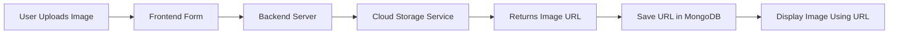

# Important Links:
**Express `router.route(path)` docs:**[https://expressjs.com/en/5x/api.html#router.route](https://expressjs.com/en/5x/api.html#router.route)

**Multer npm package:**[https://www.npmjs.com/package/multer](https://www.npmjs.com/package/multer)
# MVC (Model View Controller)

## What is MVC?

**MVC = Model + View + Controller**

It’s a design pattern used to organize your code properly so your app stays clean and scalable.

---

## One-Line Definition

**MVC separates your app into data (Model), UI (View), and logic (Controller).**

**Responsibilities:**
- Receiving request
- Talking to Model
- Sending data to View

👉 Think: *“What happens when user clicks something?”*

---

## How MVC Works Together

1. User requests `/listings/123`
2. Controller handles request
3. Controller asks Model for data
4. Model returns listing data
5. Controller sends data to View
6. View renders HTML and shows user

---

# ----------------------------------------------------------------------------------------------------------------

# #2: MVC for Listings

 **Example:**  

`controllers/listings.js`
example of one route

```js
const Listing = require("../models/listing");

// Update Route - controller
module.exports.updateListing = async (req, res) => {
  let { id } = req.params;
  await Listing.findByIdAndUpdate(id, { ...req.body.listing });
  req.flash("success", "Listing Updated!");
  res.redirect(`/listings/${id}`); // redirect to (Show Route)
};

```

`routes/listings.js`

```js
const listingController = require("../controllers/listings.js");

// Update Route
router.put(
  "/:id",
  isLoggedIn,
  isOwner,
  validateListing,
  wrapAsync(listingController.updateListing),
);
```

**Note:**  
 This functionality is exactly same for **listing routes **and **review routes**

# ----------------------------------------------------------------------------------------------------------------

 # #3: MVC for Reviews & Users:

 ## 3.1 MVC for Reviews:
 **Examples:**  

 `controller/reviews.js` 

 ```js
const Review = require("../models/review.js"); // 'Review' model required
const Listing = require("../models/listing.js"); // 'Listing' model required

// REVIEWS - post route (controller)
module.exports.createReview = async (req, res) => {
  console.log(req.params.id);
  const { id } = req.params;
  const listing = await Listing.findById(id); //  Find listing
  const newReview = new Review(req.body.review); //  Create review
  newReview.author = req.user._id; // Link review to logged-in user
  // console.log(newReview)
  listing.reviews.push(newReview); //  Link review to listing
  await newReview.save(); //  Save review
  await listing.save(); //  Save listing
  req.flash("success", "New Review Created!");
  res.redirect(`/listings/${id}`);
};
 ```

 `routes/reviews.js` 
 ```js
const reviewController = require("../controllers/reviews.js");

// REVIEWS - post route
router.post(
  "/",
  validateReview,
  isLoggedIn,
  wrapAsync(reviewController.createReview),
);
 ```

 ## 3.2 MVC for Users

 **Example:**  

 `controller/users.js` 
 ```js
const User = require("../models/user.js");

// SignUp POST route (controller)
module.exports.signup = async (req, res) => {
  try {
    let { username, email, password } = req.body;
    const newUser = new User({ email, username });
    const registeredUser = await User.register(newUser, password); // stored user info into data base.
    // console.log(registeredUser);
    req.login(registeredUser, (err) => {
      // 'req.login()' make user login automatically just after signup(register).
      if (err) {
        return next(err); // rare (err), handle using express error handler.
      }
      req.flash("success", "Welcome to Wanderlust!");
      res.redirect("/listings");
    });
  } catch (e) {
    req.flash("error", e.message);
    res.redirect("/signup");
  }
};
 ```

 `routes/users.js`
 ```js
const userController = require("../controllers/users.js")

// SignUp POST route
router.post(
  "/signup",
  wrapAsync(userController.signup),
);
 ```
# ----------------------------------------------------------------------------------------------------------------

# #4: Router.route()

**Express `router.route(path)` docs:**[https://expressjs.com/en/5x/api.html#router.route](https://expressjs.com/en/5x/api.html#router.route)

## 4.1 What is router.route()?
`router.route()` **lets you handle multiple HTTP methods for the same path in one place.**  

### Before Using `router.route()`: 
`routes/listings.js` code looks like
```js
// Index Route
router.get("/", wrapAsync(listingController.index));

// Create Route
router.post(
  "/",
  validateListing, // middleware to check validation for schema
  wrapAsync(listingController.createListing),
);
```
Here we can observe one thing (`"/"`) path is same for **Index** and **Update** route. so here we will use `router.route()` and combine both routes at one place

### After Using `router.route()`:
`routes/listings.js`
```js 
// Combines all same path ("/") of routes at one place
router
  .route("/")
  .get(wrapAsync(listingController.index)) // Index Route
  .post(
    validateListing, // middleware to check validation for schema
    wrapAsync(listingController.createListing), // Create Route
  );
```
And we can do `router.route()` for all listings, reviews and Users, if there **multiple routes** exists with **same path**, it makes our code more stuctured.

# ----------------------------------------------------------------------------------------------------------------

# #5: Re-Styling Rating:
adding feature star rating

## 5.1 STEP 1. Use this library and add .css file:
**Using this library:**[https://github.com/LunarLogic/starability/blob/master/starability-css/starability-slot.css](https://github.com/LunarLogic/starability/blob/master/starability-css/starability-slot.css)

add this .css file in our `public/css/rating.css`.

## 5.2 STEP 2. Link to .css file to  `layouts/biolerplate.ejs`
`layouts/biolerplate.ejs`
```html
    <link rel="stylesheet" href="/css/style.css" />
```

## 5.3 STEP 3. How to use: (add this code to `show.ejs` file)
`routes/show.ejs`
```html
              <div class="mb-3 mt-3">
                <label for="rating" class="form-label">Rating:</label>
                <fieldset class="starability-slot">
                  <input type="radio" id="no-rate" class="input-no-rate" name="review[rating]" value="1" checked aria-label="No rating." />
                  <input type="radio" id="first-rate1" name="review[rating]" value="1" />
                  <label for="first-rate1" title="Terrible">1 star</label>
                  <input type="radio" id="first-rate2" name="review[rating]" value="2" />
                  <label for="first-rate2" title="Not good">2 stars</label>
                  <input type="radio" id="first-rate3" name="review[rating]" value="3" />
                  <label for="first-rate3" title="Average">3 stars</label>
                  <input type="radio" id="first-rate4" name="review[rating]" value="4" />
                  <label for="first-rate4" title="Very good">4 stars</label>
                  <input type="radio" id="first-rate5" name="review[rating]" value="5" />
                  <label for="first-rate5" title="Amazing">5 stars</label>
                </fieldset>
              </div>
```

## 5.4 STEP 4. Showing the static rating result: ( means how rating star look after review done)
`routes/show.ejs`
```html
 <p class="starability-result" data-rating="<%= review.rating %>"></p>
```

# --------------------------------------------------------------------------------------------------------------

# #6: Image Upload Feature

## 6.1 Problems We Will Face While Developing Image Upload

We want to build a feature where users can directly upload images from their device.  
While implementing this, we will face the following challenges:

### ❌ 6.1.1 Problem 1: Form can't send `files` (image/photo) to backend

- The current form setup only sends **text/raw data**
- It is **not capable of sending files**

### ❌ 6.1.2 Problem 2: Size limit in MongoDB

- MongoDB stores data in **BSON format**
- BSON has a **size limit for documents**
- So, storing images directly in MongoDB is **not feasible**

## 6.2 Steps to Solve These Problems

### ✅ 6.2.1 Step 1: Make form capable of sending files

- Modify the form to support file uploads
- We **cannot store files directly in MongoDB**
- So, we will use a **3rd-party cloud service**

> ⚠️ Note:
> - Free cloud services are okay for learning
> - For production, always use a **paid and reliable cloud provider**


### ☁️ 6.2.2 Step 2: Upload files to cloud server

- Send the uploaded file to a **3rd-party cloud service**
- The cloud service will handle file storage

### 🔗 6.2.3 Step 3: Cloud server returns file URL

- After upload, the cloud service returns:
  - A **URL / link** of the uploaded image

### 💾 6.2.4 Step 4: Store URL in MongoDB

- Save the **image URL** (not the file) in MongoDB
- This keeps the database **lightweight and efficient**

## Flow:

---

# --------------------------------------------------------------------------------------------------------------

# #7: Manipulating Form

For now we are using `app.use(express.urlencoded({ extended: true }));` this line to parse our form which parse only data (econded data) not files

but Now we have to use `enctype="multipart/form-data"` line of code in our form which makes our form capable to sending files also do database server.

And to parse **multipart** - `enctype="multipart/form-data"` we use [Multer](https://www.npmjs.com/package/multer) npm package. Download it using `npm i multer` because express can't understand **multipart**

`views/listings/new.ejs`
```html
    <form
      method="POST"
      action="/listings"
      class="needs-validation"
      novalidate
      enctype="multipart/form-data" <%# "multipart/from-data" can parse files to backend %>
    >

      <div class="mb-3">
        <label for="image" class="form-label">Upload Listing Image</label>
        <input
          type="file"
          class="form-control"
          name="listing[image]"
          id="image"
        />
      </div>

    </form>
```

`routes/listings.js`
```js
const multer  = require('multer')
const upload = multer({ dest: 'uploads/' }) // 'dest' = destination; & automatically create 'upload' named folder where all image file info will save.


// Combines all same path ("/") of multiple routes at one place
router
  .route("/")
  .get(wrapAsync(listingController.index)) // Index Route
  // .post(
  //   isLoggedIn,
  //   validateListing, // middleware to check validation for schema
  //   wrapAsync(listingController.createListing) // Create Route
  // );
  .post(upload.single('listing[image]'), (req, res) => {   // "upload.single('listing[image]')" this is middleware
    res.send(req.file)
  })
```

# --------------------------------------------------------------------------------------------------------------

# #8: Cloud Setup

## Create `.env` file

- to store environment variables 
- environment varibles always written in **(`KEY:value`)** format, `KEY` - always capital letter and `value` - copied from credentials.
- don't forget to add `.env ` into `.gitignore` because .env info is always credentials so no-one other can see/access it.
- one more thing we can't access `.env` file content directly in our project-file, so to access it we use 3rd party library called [dotenv](https://www.npmjs.com/package/dotenv) npm package, to install run command `npm i dotenv` and now we have to import and configure it into server-file (app.js) 

```js
require('dotenv').config() // or import 'dotenv/config' if you're using ES6

console.log(process.env) // remove this after you've confirmed it is working
```

**Refactor Above code and add in `app.js`:**
```js
// Load environment variables from .env file only in non-production environments
if (process.env.NODE_ENV != "production") {
  require("dotenv").config();
}
```
we can access using `process.env.VARIABLE_NAME`.

**This is how we Store Credentials in `.env`:** 
```.env
CLOUD_NAME=*********
CLOUD_API_KEY=**************
CLOUD_API_SECRET=****************************
// we can't share .env credentials here, because it will push to github
```
hope you noticed there is no `space` around `=`   
finally cloud setup done.

# --------------------------------------------------------------------------------------------------------------


